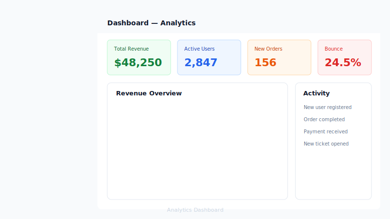
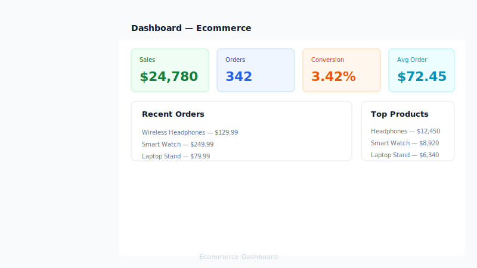
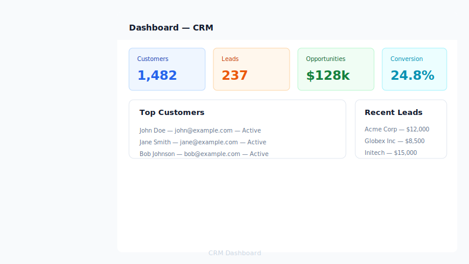
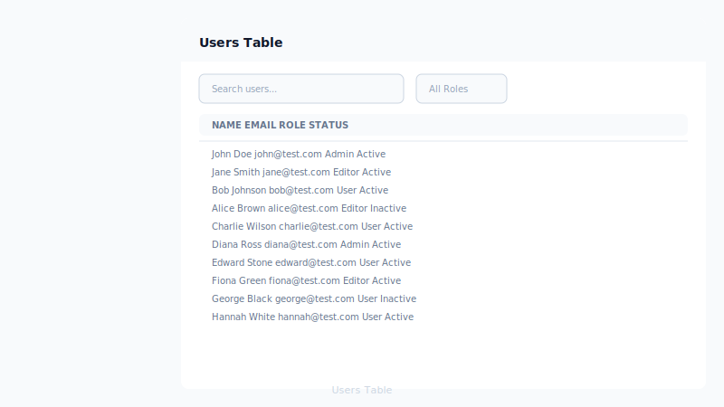
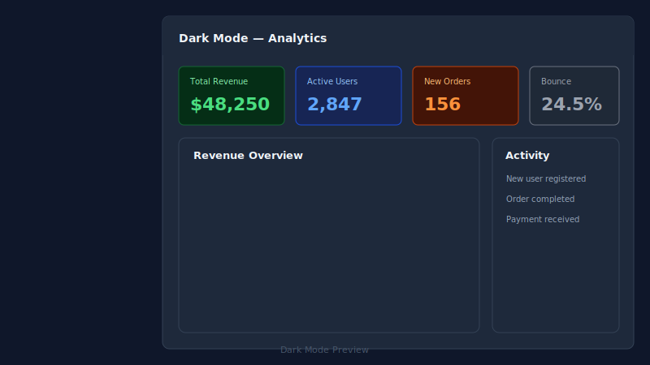

# Laravel Tailwind Admin Templates

A collection of ready-to-use Laravel Blade + TailwindCSS admin dashboard layouts, components, and page templates. No JavaScript framework required — just pure Laravel Blade components with Alpine.js for interactivity.

**GitHub Repository:** [laravel-tailwind-admin-templates](https://github.com/mmucahityilmazz/laravel-tailwind-admin-templates)

## Features

- 5 dashboard layouts (Analytics, Ecommerce, CRM, Project Management, Minimal)
- Sidebar (expanded/collapsed/mobile) + Navbar with search, notifications, profile dropdown
- Auth pages (Login, Register, Forgot Password)
- 10+ reusable Blade components (Button, Card, Alert, Modal, Dropdown, Table, Tabs, StatsCard, EmptyState)
- Profile & Settings pages with tab navigation
- Users data table with search and filter
- Forms showcase (inputs, selects, checkboxes, radios, toggles)
- Components showcase with live previews
- Error pages (403, 404, 500, 503)
- Dark mode (class-based, with toggle)
- Fully responsive (mobile, tablet, desktop)
- Docker development environment
- Alpine.js powered interactions (sidebar, dropdowns, modals, tabs, dark mode)

## Template Previews

| Template | Description |
|----------|-------------|
| **Analytics** | Charts, stat cards, recent activity, traffic sources |
| **Ecommerce** | Sales overview, top products, recent orders |
| **CRM** | Customer stats, sales pipeline, recent leads |
| **Project Management** | Active projects, team tasks, project timeline |
| **Minimal** | Clean and simple metrics overview |

## Components

- **Alert** — success/warning/danger/info with dismiss button
- **Button** — 7 variants (primary/secondary/success/danger/warning/outline/ghost), 4 sizes
- **Card** — with header, body, footer sections
- **Dropdown** — click-toggle with menu items and dividers
- **EmptyState** — icon, title, description, CTA action
- **Modal** — 3 sizes (sm/md/lg), header, body, footer
- **Navbar** — logo, search, notifications, dark mode toggle, profile dropdown
- **Sidebar** — expanded/collapsed states, mobile overlay, navigation groups
- **StatsCard** — icon, value, label, trend indicator
- **Tab** — horizontal tab switching
- **Table** — striped, hover, responsive with header/footer

## Installation

### Docker (Recommended)

```bash
# Clone the repository
git clone https://github.com/mmucahityilmazz/laravel-tailwind-admin-templates.git
cd laravel-tailwind-admin-templates

# Copy environment file
cp .env.example .env

# Start Docker containers
docker compose up -d

# Install PHP dependencies and run migrations
docker compose exec app composer install
docker compose exec app php artisan migrate

# Build assets (in another terminal)
docker compose exec node npm install
docker compose exec node npm run build
```

The application will be available at: [http://localhost:8080](http://localhost:8080)

### Local Development

```bash
# Clone the repository
git clone https://github.com/mmucahityilmazz/laravel-tailwind-admin-templates.git
cd laravel-tailwind-admin-templates

# Install PHP dependencies
composer install

# Install Node dependencies
npm install

# Copy environment file and generate key
cp .env.example .env
php artisan key:generate

# Start development server
php artisan serve

# Build assets (in another terminal)
npm run dev
```

The application will be available at: [http://localhost:8000](http://localhost:8000)

## Usage Examples

All components can be used directly in your Blade templates:

```blade
<x-button variant="primary" size="md">Click Me</x-button>
<x-button variant="danger" size="sm">Delete</x-button>
<x-button variant="outline">Cancel</x-button>

<x-alert type="success">Operation completed successfully!</x-alert>
<x-alert type="danger">An error occurred.</x-alert>

<x-card>
    <x-slot:header>Card Title</x-slot:header>
    <p>Card content goes here.</p>
</x-card>

<x-statscard label="Revenue" value="$48,250" change="+12.5%" trend="up" color="emerald">
    <x-slot:icon>
        <svg class="w-5 h-5">...</svg>
    </x-slot:icon>
</x-statscard>

<x-modal>
    <x-slot:trigger>
        <x-button>Open Modal</x-button>
    </x-slot:trigger>
    <x-slot:header>Modal Title</x-slot:header>
    <p>Modal content</p>
</x-modal>
```

## Screenshots

### Dashboard Analytics


### Dashboard Ecommerce


### Dashboard CRM


### Components Showcase


### Forms Showcase


### Users Table


### Dark Mode


## Customization

### Colors
The template uses standard TailwindCSS color palette. You can customize colors in your `app.css` using the `@theme` directive.

### Layouts
To use the admin layout in your pages:

```blade
<x-layouts-admin>
    <h1>Your content here</h1>
</x-layouts-admin>
```

For auth pages:

```blade
<x-layouts-guest>
    <h1>Auth content</h1>
</x-layouts-guest>
```

### Dark Mode
Dark mode is class-based. Toggle it using the moon/sun icon in the navbar, or programmatically:

```javascript
localStorage.setItem('theme', 'dark')
document.documentElement.classList.add('dark')
```

## Roadmap

- [ ] Color theme variants (blue, green, purple)
- [ ] Live theme editor
- [ ] Filament integration package
- [ ] 10+ dashboard layouts
- [ ] Live preview page

## License

MIT License — see the [LICENSE](LICENSE) file for details.

## Author

**M. Mücahit Yılmaz**

- LinkedIn: [https://www.linkedin.com/in/mmucahityilmazz/](https://www.linkedin.com/in/mmucahityilmazz/)
- GitHub: [mmucahityilmazz](https://github.com/mmucahityilmazz)
